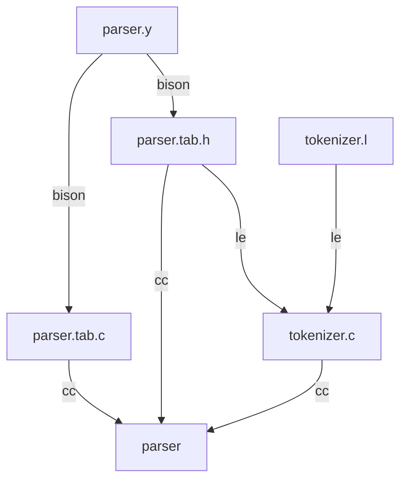

# Example flex and bison

A quick example to get yourself started with **flex** and **bison**.
If you want to start creating a quick parser out of the box, it may take too long to get a basic setup working.
This repo is meant to get you started.

## About flex and bison

**Flex** and **bison** are tools for generating lexical analyzers (scanners) and parsers respectively, for use in computer programming.

Flex (Fast Lexical Analyzer) is a program that generates a lexical analyzer or scanner, which reads in a stream of characters from a source code file and breaks it down into tokens or lexemes that can be used in parsing the source code. Flex uses regular expressions to specify the patterns that define the tokens.

Bison (GNU Parser Generator) is a program that generates a parser, which reads in the tokens produced by the lexical analyzer and creates a syntax tree that represents the structure of the source code. Bison uses a context-free grammar to define the syntax of the language being parsed.

Together, flex and bison form a powerful combination for building compilers and interpreters for programming languages. They can be used to generate code in a variety of programming languages, including C, C++, and Java, among others.

Flex and bison are modern replacements for the older tools Lex and Yacc, respectively. Lex and Yacc were developed in the 1970s at AT&T Bell Labs and were widely used for many years in the development of compilers and interpreters.

This graph shows the build flow to create the parser executable (see Makefile)


## Mac OSX

```
brew install flex bison
```

## Linux

```
sudo apt install flex bison
```

## Build and execute

```
make
./parser
```