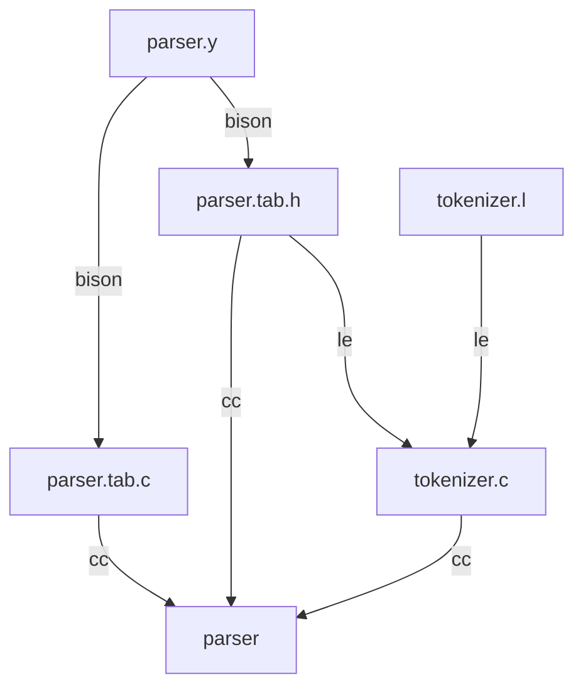

# Basic example using flex and bison

A quick example to get yourself started with **flex** and **bison**.
If you want to start creating a quick parser out of the box, it may take too long to get a basic setup working.
This repo is meant to get you started.



This graph shows the build flow to create the parser executable (see Makefile)

## About flex and bison

**Flex** and **bison** are tools for generating lexical analyzers (scanners) and parsers respectively, for use in development of compilers and interpreters.
They are the GNU alternatives for **lex** and **yacc**.

## Mac OSX

```
brew install flex bison
```

## Linux

```
sudo apt install flex bison
```

## Build and execute

```
$ make
bison -d parser.y
flex -o tokenizer.c tokenizer.l
cc parser.tab.c tokenizer.c -o parser -O2 -lc -ll
$ ./parser 
heat off target temperature 62 heat on
        Heat turned off
        Temperature set to 62 Fahrenheit
        Heat turned on
```

## Reference links

- [Flex project page](https://github.com/westes/flex/)
- [Flex wiki](https://en.wikipedia.org/wiki/Flex_\(lexical_analyser_generator\))
- [Bison project](https://www.gnu.org/software/bison/)
- [Bison wiki](https://en.wikipedia.org/wiki/GNU_Bison)
