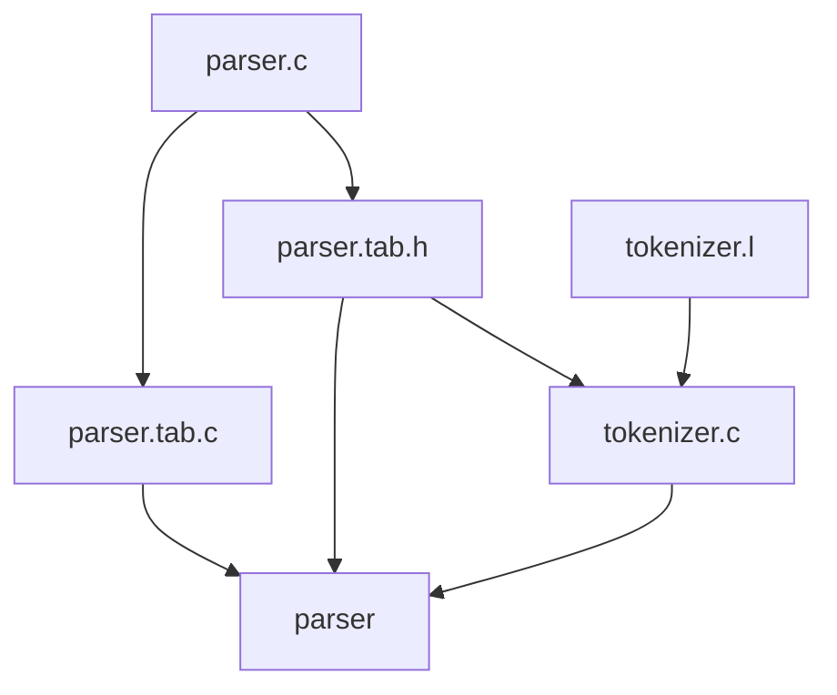

# Example Flex and Bison

A quick example to get yourself started with Flex and Bison.
If you want to start creating a quick parser out of the box, it may take too long to get a basic setup working.
This repo is meant to get you started.

Flex and Bison are the GNU based succesors for Lex and Yacc.
Flex builds a tokenizer and together with Bison creates a parser.

Build flow to create the parser


## Mac OSX

```
brew install flex bison
```

## Linux

```
sudo apt install flex bison
```

