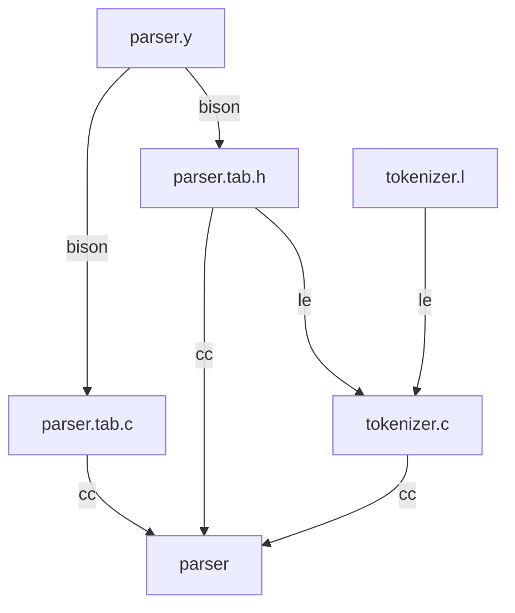

# Basic example using flex and bison

A quick example to get yourself started with **flex** and **bison**.
If you want to start creating a quick parser out of the box, it may take too long to get a basic setup working.
This repo is meant to get you started.


```mermaid
graph TD;
    A[parser.y]--bison--> B[parser.tab.h];
    A--bison--> C[parser.tab.c];
    B--lex--> D[tokenizer.c];
    E[tokenizer.l]--lex--> D;
    C--cc--> F[parser]
    B--cc--> F
    D--cc--> F
```

This graph shows the build flow to create the parser executable (see Makefile)

## About flex and bison

**Flex** and **bison** are tools for generating lexical analyzers (scanners) and parsers respectively, for use in development of compilers and interpreters.
They are the GNU alternatives for **lex** and **yacc**.

## Mac OSX

```
brew install flex bison
```

## Linux

```
sudo apt install flex bison
```

## Build and execute

```
$ make
bison -d parser.y
flex -o tokenizer.c tokenizer.l
cc parser.tab.c tokenizer.c -o parser -O2 -lc -ll
$ ./parser 
heat off target temperature 62 heat on
        Heat turned off
        Temperature set to 62 Fahrenheit
        Heat turned on
```

## Compiler Theory

Compiler theory is a branch of computer science that deals with the design, implementation, and optimization of compilers. A compiler is a program that translates source code written in a high-level programming language into a lower-level language, such as assembly language or machine code.

The main phases of a compiler are:

1.  **Lexical Analysis:** Also known as scanning, this phase reads the source code and groups characters into meaningful sequences called lexemes. It produces a stream of tokens, each representing a lexeme (e.g., keywords, identifiers, operators).
2.  **Syntax Analysis:** Also known as parsing, this phase takes the token stream from the lexical analyzer and verifies that it conforms to the grammatical rules of the source language. It typically constructs a parse tree or an abstract syntax tree (AST) representing the syntactic structure of the code.
3.  **Semantic Analysis:** This phase checks the source code for semantic errors, ensuring that the meaning of the program is valid. It performs tasks like type checking, scope resolution, and ensuring that variables are declared before use.
4.  **Intermediate Code Generation:** After semantic analysis, this phase translates the source code into an intermediate representation (IR). This IR is typically a lower-level, machine-independent representation that is easier to optimize and translate into machine code.
5.  **Optimization:** This phase aims to improve the intermediate code to make it run faster, consume less memory, or both. Various optimization techniques can be applied, such as constant folding, dead code elimination, and loop optimization.
6.  **Code Generation:** This is the final phase where the optimized intermediate code is translated into the target language, which is often machine code or assembly language for a specific processor architecture.

These phases work together to transform a high-level program into an executable form.

## Reference links

- [Flex project page](https://github.com/westes/flex/)
- [Flex wiki](https://en.wikipedia.org/wiki/Flex_\(lexical_analyser_generator\))
- [Bison project](https://www.gnu.org/software/bison/)
- [Bison wiki](https://en.wikipedia.org/wiki/GNU_Bison)
- [Wikipedia - Compiler](https://en.wikipedia.org/wiki/Compiler)
- [Stanford CS143 - Compilers Course](https://web.stanford.edu/class/cs143/)

A highly recommended textbook on the subject is "Compilers: Principles, Techniques, and Tools" by Aho, Sethi, and Ullman (often referred to as the Dragon Book).
